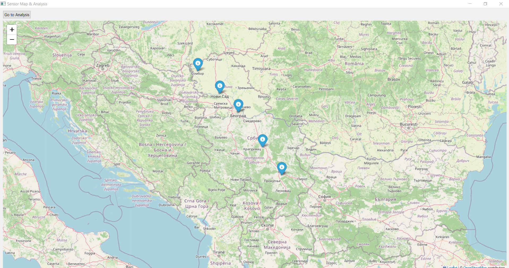
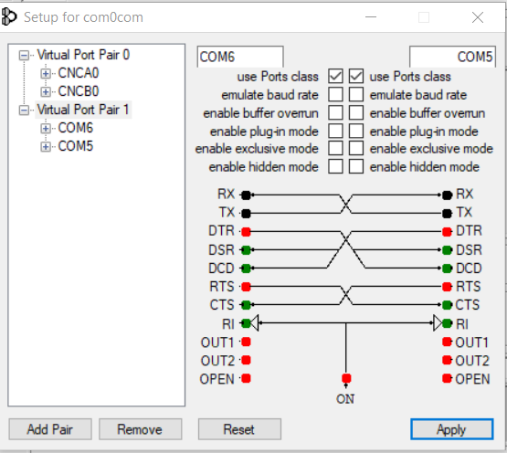
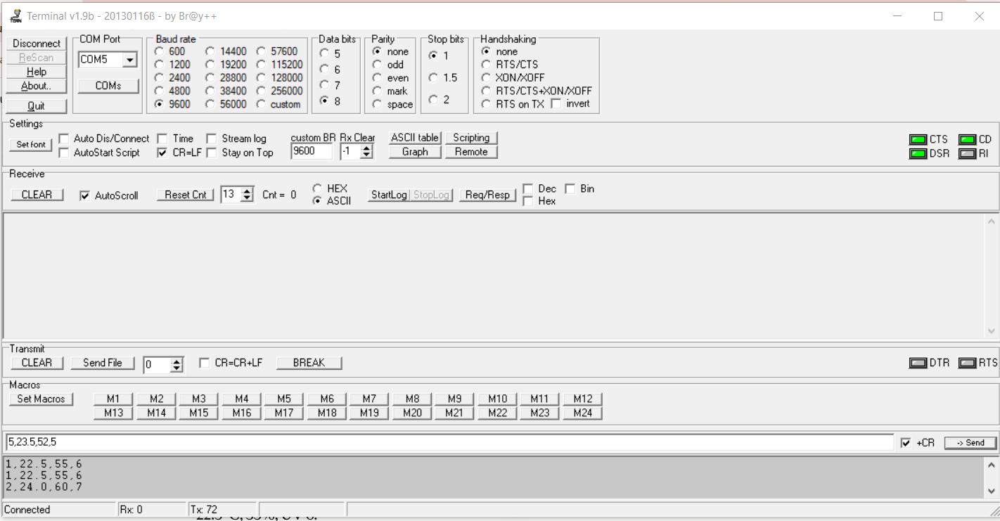
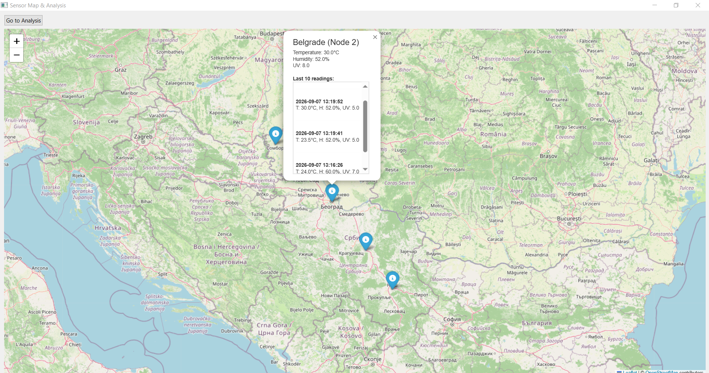
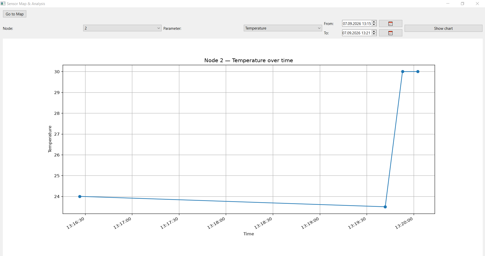
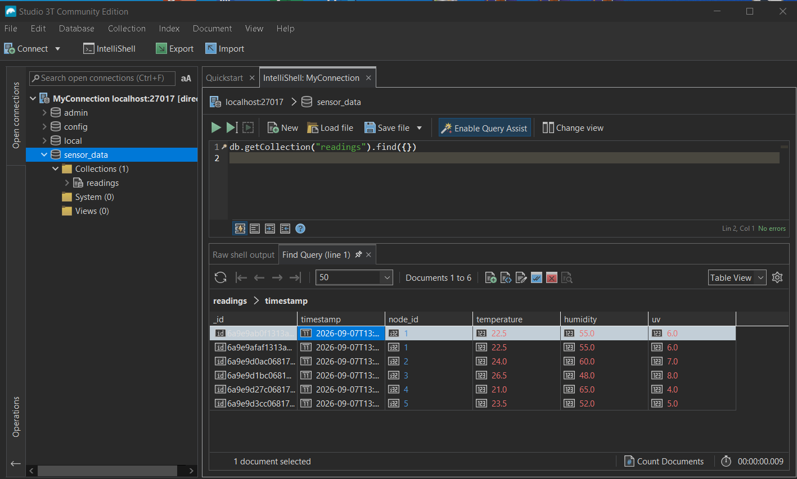

# Sensor Data Simulation and Map Visualization

A desktop application that simulates sensor-data transmission over a virtual COM
port, stores each reading in MongoDB, and visualizes both live and historical
data. The map shows the latest values per node; the analysis view plots any
parameter over a time range. Sensor values are sent manually from the Br@y
terminal, which makes it easy to test the whole pipeline without real hardware.

Built with Python, PySide6, PySerial, Folium, Matplotlib, and MongoDB.



## Requirements

- Python 3.10+
- A running MongoDB instance (default: `localhost:27017`)
- [com0com](https://sourceforge.net/projects/com0com/) — creates a pair of
  linked virtual COM ports (Windows)
- [Br@y Terminal](https://sites.google.com/site/terminalbpp/) — sends the sensor
  values

## Setup

1. Clone the repository and open the project folder.
2. Create and activate a virtual environment:
   - Windows: `python -m venv venv` then `.\venv\Scripts\Activate`
   - macOS/Linux: `python3 -m venv venv` then `source venv/bin/activate`
3. Install dependencies: `pip install -r requirements.txt`
4. Start MongoDB.
5. Adjust `SourceCode/config.py` for your setup (serial port, MongoDB, node locations).
6. Run the app from the project root: `python main.py`

## Virtual serial port (com0com)

The application listens on one COM port while the terminal sends on the other
end of the same pair. Two programs cannot share a single port, so a linked pair
is required.

1. Install com0com and open its Setup tool.
2. Create a pair and name the two ends, e.g. `COM6` and `COM5`.
3. Set `SERIAL_PORT` in `SourceCode/config.py` to the end the app should listen on (`COM6`).



## Sending values (Br@y Terminal)

1. Open Br@y Terminal, select the *other* end of the pair (`COM5`).
2. Set baud rate `9600`, data bits `8`, parity `none`, stop bits `1`.
3. Enable `CR=LF` (Settings) and `+CR` (next to Send) so each line ends with a
   newline — the app reads one line at a time.
4. Click `Connect`, type a line, and click `-> Send`.



### Serial protocol

Each line is comma-separated. Supported formats:

1. `<node>,<temp>` — set temperature only
2. `<node>,<temp>,<hum>` — set temperature and humidity
3. `<node>,<temp>,<hum>,<uv>` — set all three
4. `<node>,<param>,<value>` — set a single field, where `param` is `temp`, `hum`, or `uv`
5. `stop` — stops the reader loop

Examples: `2,25.5` · `4,20,60` · `3,temp,30` · `1,22.5,55,6`

## How it works

The application code lives in the `SourceCode` package, and data flows through
its modules in one direction:

```
Br@y Terminal  ──serial──▶  serial_reader.py  ──▶  map_window.py  ──▶  database.py
   (sends a line)          (reads + parses)      (merges + saves)     (MongoDB)
                                                        │
                                                        ▼
                                                  Folium map refresh
```

Step by step, when a line is sent:

1. `serial_reader.py` reads the line on a background thread and `parse_reading()`
   turns it into a node id and a set of changed fields (e.g. `3,temp,30` becomes
   `(3, {"temperature": 30.0})`). Values are converted to numbers here.
2. The reader emits a Qt signal, which Qt safely delivers to the GUI thread.
3. `map_window.py` receives it, merges the change into that node's current
   values, writes the full reading to MongoDB, and redraws the map.
4. `database.py` inserts the reading with a timestamp. The map marker turns blue
   and its popup shows the current values plus the last 10 readings.

Because the serial reader is separate from the UI and the parsing is a pure
function, each part can be understood and tested on its own.



### Analysis view

The analysis page reads directly from MongoDB (it does not use the serial port).
Pick a node, a parameter, and a time range, and it plots every stored reading in
that interval with Matplotlib.



### Stored data

Every reading is one MongoDB document in the `readings` collection, with the
fields `timestamp`, `node_id`, `temperature`, `humidity`, and `uv`.



## Project layout

```
.
├── main.py               # entry point and page navigation (run this)
├── requirements.txt
├── README.md
├── docs/                 # screenshots used in this README
└── SourceCode/           # application package
    ├── __init__.py       # marks the folder as a Python package
    ├── config.py         # all settings and node definitions
    ├── database.py       # MongoDB read/write helpers
    ├── serial_reader.py  # serial port loop and line parsing
    ├── map_window.py     # map page
    └── analysis_window.py# analysis / chart page
```

